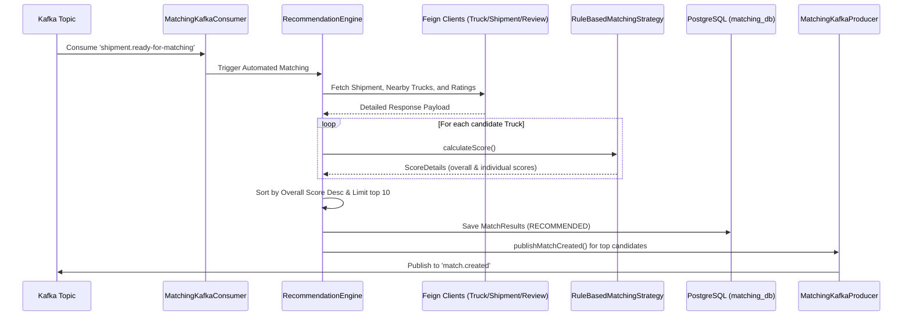
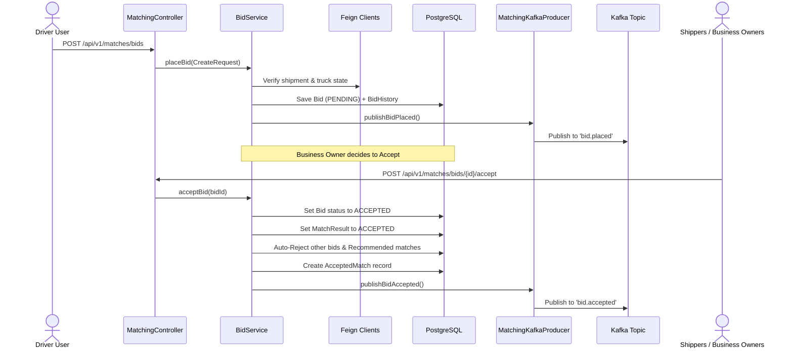

# Matching Service

The Matching Service is the automated matching and bidding engine of the **Smart Logistics Optimization Platform**. It connects shippers (Business Owners) needing shipment transportation with available carriers (Drivers/Trucks) based on a configurable multi-metric rule-based scoring system. The service is architected to seamlessly support transition to machine learning matching strategy implementations in the future.

---

## 🏗️ Architecture

Following the principles of **Clean Architecture** and **SOLID**, the Matching Service is split into highly cohesive packages:

- `client`: REST clients built with OpenFeign for inter-service communication (fetching truck availability, driver ratings, and shipment metadata).
- `config`: Security header filter propagation, OpenFeign configurations, and Swagger documentation setups.
- `constants`: Centralized definitions of statuses, rule codes, and Kafka topic names.
- `controller`: API boundaries propagating `ApiResponse` wrappers.
- `dto`: Boundaries separating API representations from database mappings.
- `entity`: Database schemas extending the platform's `BaseEntity` (soft delete, optimistic locking, auditing).
- `events`: Kafka message listeners (Consumers) and message publishers (Producers).
- `mapper`: Compile-time safe mapping using MapStruct.
- `service`: Business core, seeder, scheduler, and strategies.
- `service/strategy`: Decoupled Strategy Pattern implementations mapping rules into numeric scores.

---

## ⚡ Matching Flow



---

## 💵 Bidding Flow



---

## 🧬 Rule-Based Matching Strategy

Matching scores ($0-100$) are calculated as a weighted average of active scoring rules:

$$\text{Overall Score} = \frac{\sum (\text{Rule Score} \times \text{Rule Weight})}{\sum \text{Rule Weight}}$$

### Scoring Metrics
1. **Pickup Distance**: Compares truck coordinates and shipment origin coordinates. Score decays linearly to $0$ at the `maxDistanceKm` threshold.
2. **Destination Similarity**: Evaluates closeness of current truck location to the shipment destination relative to total route length.
3. **Truck Capacity**: Checks if truck handles shipment weight and volume. Hard constraint (score drops to $0.0$ if breached).
4. **Cargo Compatibility**: Checks if truck type matches required truck type. Hard constraint if required type is set and mismatched.
5. **Availability**: Checks if truck is marked available. Hard constraint.
6. **Vehicle Type**: Evaluates truck configuration matches.
7. **Driver Rating**: Fetches driver stars from review-service, mapping a $5.0$ star rating to a $100.0$ score.
8. **Business Preference**: Allows preference adjustments for trusted driver interactions.

---

## 🤖 Future AI/ML Integration

The matching engine is designed **AI-ready** using the **Strategy Pattern**:

```java
public interface MatchingStrategy {
    MatchResultDto.ScoreDetails calculateScore(
            MatchRequest request,
            DetailedShipmentResponse shipment,
            TruckDTO.Response truck);
}
```

To swap or enhance scoring using an AI/ML recommendation model:
1. Implement the `MatchingStrategy` interface (e.g., `MLMatchingStrategy`).
2. Integrate it into `RecommendationService` or use standard Spring profiling / configuration properties to set it as the primary strategy bean.
3. The rest of the API Gateway, REST controller, Kafka triggers, and security mechanisms remain unchanged.

---

## 📬 Kafka Topics

### Consumed
- `shipment.ready-for-matching`: Triggers recommendation calculation for newly available shipments.
- `shipment.cancelled`: Triggers cleanup of recommendations/bids associated with cancelled cargo.
- `truck.availability.changed`: Updates and invalidates recommended matches if a truck becomes unavailable.
- `truck.deleted`: Invalidates recommended matches for deleted vehicles.
- `trip.completed`: Transitions accepted matches and bids to the `COMPLETED` state.

### Published
- `match.created`: Notifies driver devices of a new recommended match.
- `bid.placed`: Notifies business owner devices of a new bidding proposal.
- `bid.accepted`: Signals finalization of shipment assignment.
- `bid.rejected`: Notifies driver of rejection.
- `match.expired`: Signals match TTL expiration.
- `match.completed`: Signals matching flow finalization after delivery.

---

## 🧪 Testing Guide

To verify the service:
Run clean compile and all automated unit/integration tests:
```bash
mvn clean test
```

### Key Test Classes
- [RuleBasedMatchingStrategyTest](file:///c:/Users/Suyog/Desktop/Projects/smart-logistics-platform/backend/matching-service/src/test/java/com/smartlogistics/matchingservice/service/strategy/RuleBasedMatchingStrategyTest.java): Validates scoring calculation formulas and capacity limits.
- [MatchingServiceTest](file:///c:/Users/Suyog/Desktop/Projects/smart-logistics-platform/backend/matching-service/src/test/java/com/smartlogistics/matchingservice/service/MatchingServiceTest.java): Tests automated trigger and manual execution of recommendation engine.
- [BidServiceTest](file:///c:/Users/Suyog/Desktop/Projects/smart-logistics-platform/backend/matching-service/src/test/java/com/smartlogistics/matchingservice/service/BidServiceTest.java): Tests placing, accepting, and rejecting bids.
- [MatchingControllerTest](file:///c:/Users/Suyog/Desktop/Projects/smart-logistics-platform/backend/matching-service/src/test/java/com/smartlogistics/matchingservice/controller/MatchingControllerTest.java): Verifies path variables, request constraints, and spring-security role mappings.
