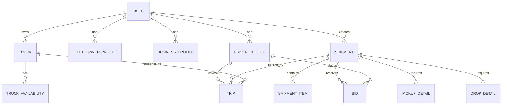

# Database Architecture: Smart Logistics Optimization Platform

## 1. Introduction
This document defines the complete database architecture for the Smart Logistics Optimization Platform. The platform uses a **Database-per-Service** architecture, meaning each microservice has its own isolated schema. Inter-service data requirements are handled via asynchronous Kafka events or synchronous REST/OpenFeign calls.

## 2. Naming Conventions & Global Standards
*   **Table Names:** `snake_case`, plural (e.g., `users`, `trucks`).
*   **Column Names:** `snake_case` (e.g., `first_name`, `created_at`).
*   **Primary Keys:** `id` of type `UUID` for global uniqueness and security.
*   **Foreign Keys:** `<table_singular>_id` (e.g., `user_id`). Only used within the same microservice. For references to other microservices, the UUID is stored but no physical DB foreign key constraint is applied.
*   **Indexes:** `idx_<table_name>_<column_name>`.
*   **Unique Constraints:** `uq_<table_name>_<column_name>`.

### 2.1 Standard Columns (Audit & Versioning)
Every entity in the system includes the following standard columns:
*   `id` (UUID): Primary Key
*   `created_at` (TIMESTAMP): Creation timestamp
*   `updated_at` (TIMESTAMP): Last modification timestamp
*   `created_by` (UUID): ID of the user who created the record (nullable)
*   `updated_by` (UUID): ID of the user who last updated the record (nullable)
*   `is_deleted` (BOOLEAN): Soft delete flag (default `false`)
*   `version` (INTEGER): Optimistic locking version (default `0`)

*Note: For brevity, standard columns are assumed on all tables below and won't be repeated in the column lists.*

## 3. Database Ownership per Microservice
1.  **user-service:** `user_db` (PostgreSQL)
2.  **truck-service:** `truck_db` (PostgreSQL)
3.  **shipment-service:** `shipment_db` (PostgreSQL)
4.  **matching-service:** `matching_db` (PostgreSQL)
5.  **tracking-service:** `tracking_db` (PostgreSQL + Redis for cache)
6.  **notification-service:** `notification_db` (PostgreSQL)
7.  **review-service:** `review_db` (PostgreSQL)
8.  **analytics-service:** `analytics_db` (PostgreSQL / Data Warehouse)
9.  **admin-service:** `admin_db` (PostgreSQL)

## 4. Entity Relationship (ER) Diagram (Logical View)

*(Note: Physical Foreign Keys only exist within the same bounded context/microservice)*

---

## 5. Microservices Data Dictionary

### 5.1 User Module (`user-service`)

#### `users`
*   **Purpose:** Core user account and authentication data.
*   **Lifecycle:** Created on signup, soft-deleted on account closure.
*   **Relationships:** One-to-One with profiles; One-to-Many with addresses, documents, tokens.
*   **Cascade Rules:** Soft-delete cascades to tokens and history.
*   **Soft Delete / Audit:** Yes / Yes
*   **Indexes:** `idx_users_email`, `idx_users_phone`

| Column | Type | Constraints | Null | Description |
| :--- | :--- | :--- | :--- | :--- |
| `email` | VARCHAR | UNIQUE | No | User's email |
| `password_hash`| VARCHAR | | No | BCrypt hashed password |
| `phone` | VARCHAR | UNIQUE | Yes | Mobile number |
| `status` | VARCHAR | | No | ACTIVE, BLOCKED, PENDING |

#### `roles` & `permissions` & `user_roles` (RBAC)
*   **Purpose:** Role-Based Access Control.
*   **Lifecycle:** Managed by Admins. Static seed data.
*   **Relationships:** Many-to-Many users <-> roles <-> permissions.

| Table | Specific Columns (Excl. Standard) |
| :--- | :--- |
| `roles` | `name` (VARCHAR, UNIQUE), `description` (VARCHAR) |
| `permissions` | `name` (VARCHAR, UNIQUE), `description` (VARCHAR) |
| `user_roles` | `user_id` (FK to users), `role_id` (FK to roles) |

#### Profiles (`driver_profiles`, `business_profiles`, `fleet_owner_profiles`)
*   **Purpose:** Specific details based on user type.
*   **Lifecycle:** Created during onboarding.
*   **Relationships:** One-to-One with `users`.

| Table | Specific Columns |
| :--- | :--- |
| `driver_profiles` | `user_id` (UNIQUE FK), `license_number` (UNIQUE), `license_expiry` (DATE), `experience_years` (INT), `status` (VARCHAR) |
| `business_profiles` | `user_id` (UNIQUE FK), `company_name` (VARCHAR), `tax_id` (VARCHAR), `website` (VARCHAR, Nullable) |
| `fleet_owner_profiles` | `user_id` (UNIQUE FK), `fleet_size` (INT), `company_name` (VARCHAR) |

#### `addresses`, `user_documents`, `emergency_contacts`, `device_tokens`, `login_history`
*   **Purpose:** Supplementary user data.
*   **Relationships:** Many-to-One to `users`.

| Table | Specific Columns |
| :--- | :--- |
| `addresses` | `user_id` (FK), `line1`, `line2`, `city`, `state`, `zip`, `country`, `type` (VARCHAR) |
| `user_documents` | `user_id` (FK), `type` (VARCHAR), `url` (VARCHAR), `status` (VARCHAR) |
| `emergency_contacts` | `user_id` (FK), `name`, `phone`, `relationship` |
| `device_tokens` | `user_id` (FK), `token` (VARCHAR), `platform` (VARCHAR) |
| `login_history` | `user_id` (FK), `ip_address`, `user_agent`, `login_time` (TIMESTAMP) |

---

### 5.2 Truck Module (`truck-service`)

#### `trucks`
*   **Purpose:** Core truck entity.
*   **Lifecycle:** Registered by Fleet Owner / Driver. Soft-deleted on retirement.
*   **Relationships:** Belongs to owner_id (logical FK to User). One-to-Many to images, docs, capacity.

| Column | Type | Constraints | Null | Description |
| :--- | :--- | :--- | :--- | :--- |
| `owner_id` | UUID | Logical FK | No | Points to user-service |
| `plate_number` | VARCHAR | UNIQUE | No | Vehicle plate |
| `make` | VARCHAR | | No | E.g. Volvo |
| `model` | VARCHAR | | No | E.g. FH16 |
| `year` | INT | | No | Manufacturing year |
| `type` | VARCHAR | INDEX | No | FLATBED, REEFER, etc. |

#### `truck_capacity`, `truck_availability`, `truck_location_snapshots`, `truck_status_history`
*   **Relationships:** Many-to-One with `trucks`.

| Table | Specific Columns |
| :--- | :--- |
| `truck_capacity` | `truck_id` (FK), `max_weight` (DECIMAL), `max_volume` (DECIMAL), `unit` (VARCHAR) |
| `truck_availability` | `truck_id` (FK), `start_date`, `end_date`, `lat`, `lng`, `status` (AVAILABLE, BOOKED) |
| `truck_location_snapshots`| `truck_id` (FK), `lat`, `lng`, `timestamp`. *(Note: Denormalized for quick querying)* |
| `truck_status_history` | `truck_id` (FK), `status`, `reason`, `timestamp` |

#### `truck_images`, `truck_documents`, `truck_maintenance`, `truck_insurance`
| Table | Specific Columns |
| :--- | :--- |
| `truck_images` | `truck_id` (FK), `image_url`, `is_primary` (BOOLEAN) |
| `truck_documents`| `truck_id` (FK), `type`, `url`, `expiry_date`, `status` |
| `truck_maintenance`| `truck_id` (FK), `date`, `cost`, `description` |
| `truck_insurance`| `truck_id` (FK), `provider`, `policy_number`, `expiry_date` |

---

### 5.3 Shipment Module (`shipment-service`)

#### `shipments`
*   **Purpose:** Core load / shipment request.
*   **Lifecycle:** Created by Business User. Completes upon delivery.
*   **Relationships:** Belongs to customer_id. One-to-Many to items, status history.

| Column | Type | Constraints | Null | Description |
| :--- | :--- | :--- | :--- | :--- |
| `customer_id` | UUID | Logical FK | No | User ID of shipper |
| `title` | VARCHAR | | No | Short description |
| `status` | VARCHAR | INDEX | No | CREATED, ASSIGNED, IN_TRANSIT, DELIVERED |

#### `shipment_items`, `shipment_dimensions`, `shipment_pricing`, `shipment_categories`
| Table | Specific Columns |
| :--- | :--- |
| `shipment_items` | `shipment_id` (FK), `name`, `quantity` (INT), `weight` (DECIMAL) |
| `shipment_dimensions`| `shipment_id` (UNIQUE FK), `length`, `width`, `height`, `weight` |
| `shipment_pricing` | `shipment_id` (UNIQUE FK), `base_price`, `tax`, `total`, `currency` |
| `shipment_categories`| `name` (UNIQUE), `description` (Standalone taxonomy table) |

#### `pickup_details`, `drop_details`, `shipment_images`, `shipment_documents`, `shipment_status_history`
| Table | Specific Columns |
| :--- | :--- |
| `pickup_details` | `shipment_id` (UNIQUE FK), `address_id` (Logical), `expected_time`, `actual_time`, `contact_name`, `contact_phone` |
| `drop_details` | `shipment_id` (UNIQUE FK), `address_id` (Logical), `expected_time`, `actual_time`, `contact_name`, `contact_phone` |
| `shipment_status_history` | `shipment_id` (FK), `status`, `notes`, `timestamp` |

---

### 5.4 Matching Module (`matching-service`)

#### `bids` & `bid_history`
*   **Purpose:** Driver bidding on loads.
*   **Lifecycle:** Driver places bid, Shipper accepts/rejects.

| Table | Specific Columns |
| :--- | :--- |
| `bids` | `shipment_id` (Logical FK), `driver_id` (Logical FK), `truck_id` (Logical FK), `amount` (DECIMAL), `status` (PENDING, ACCEPTED, REJECTED) |
| `bid_history` | `bid_id` (FK), `status`, `timestamp` |

#### `ai_match_results`, `accepted_matches`, `rejected_matches`
*   **Purpose:** System-generated matching using AI.

| Table | Specific Columns |
| :--- | :--- |
| `ai_match_results`| `shipment_id` (Logical), `truck_id` (Logical), `driver_id` (Logical), `match_score` (DECIMAL) |
| `accepted_matches`| `shipment_id`, `truck_id`, `driver_id`, `amount` (DECIMAL) |
| `rejected_matches`| `shipment_id`, `truck_id`, `driver_id`, `reason` |

#### `driver_requests`, `load_requests`
| Table | Specific Columns |
| :--- | :--- |
| `driver_requests` | `driver_id` (Logical), `preferred_routes` (JSONB), `max_distance` (INT) |
| `load_requests` | `shipment_id` (Logical), `required_truck_type` (VARCHAR) |

---

### 5.5 Tracking Module (`tracking-service`)

#### `trips`
*   **Purpose:** Execution of a matched shipment.
*   **Lifecycle:** Created when match accepted. Closed upon delivery.

| Column | Type | Constraints | Null | Description |
| :--- | :--- | :--- | :--- | :--- |
| `shipment_id` | UUID | Logical FK, INDEX| No | Associated Shipment |
| `truck_id` | UUID | Logical FK | No | Associated Truck |
| `driver_id` | UUID | Logical FK | No | Associated Driver |
| `status` | VARCHAR | | No | PLANNED, EN_ROUTE, COMPLETED |
| `start_time` | TIMESTAMP | | Yes | Actual start |
| `end_time` | TIMESTAMP | | Yes | Actual end |

#### `trip_routes`, `gps_logs`, `fuel_logs`, `stops`, `trip_events`
| Table | Specific Columns |
| :--- | :--- |
| `trip_routes` | `trip_id` (UNIQUE FK), `polyline` (TEXT), `estimated_distance`, `estimated_duration` |
| `gps_logs` | `trip_id` (FK), `lat`, `lng`, `speed`, `timestamp`. *(High volume table)* |
| `fuel_logs` | `trip_id` (FK), `location`, `volume`, `cost`, `timestamp` |
| `stops` | `trip_id` (FK), `type` (REST, WEIGH), `start_time`, `end_time`, `location` |
| `trip_events` | `trip_id` (FK), `event_type` (DELAY, ACCIDENT), `description`, `timestamp` |

---

### 5.6 Notification Module (`notification-service`)

| Table | Specific Columns |
| :--- | :--- |
| `notifications` | `user_id`, `title`, `message`, `type` (INFO, ALERT), `read_status` (BOOL) |
| `notification_preferences`| `user_id` (UNIQUE), `email_enabled`, `sms_enabled`, `push_enabled` |
| `email_queue` | `to_email`, `subject`, `body` (TEXT), `status` (PENDING, SENT, FAILED), `retry_count` |
| `sms_queue` | `to_phone`, `message`, `status`, `retry_count` |
| `push_queue` | `device_token`, `payload` (JSONB), `status`, `retry_count` |

---

### 5.7 Review Module (`review-service`)

| Table | Specific Columns |
| :--- | :--- |
| `reviews` | `reviewer_id`, `reviewee_id`, `target_type` (DRIVER, SHIPPER), `comment` |
| `ratings` | `review_id` (UNIQUE FK), `score` (DECIMAL 1-5) |
| `review_replies` | `review_id` (FK), `replier_id`, `comment` |
| `reported_reviews`| `review_id` (FK), `reporter_id`, `reason`, `status` |

---

### 5.8 Admin Module (`admin-service`)

| Table | Specific Columns |
| :--- | :--- |
| `audit_logs` | `user_id` (Logical), `action` (VARCHAR), `resource` (VARCHAR), `details` (JSONB), `ip_address`, `timestamp` |
| `blocked_users` | `user_id` (UNIQUE), `reason`, `blocked_by`, `unblock_date` |
| `reported_users` | `reported_user_id`, `reporter_id`, `reason`, `status` (INVESTIGATING, RESOLVED) |
| `system_settings` | `key` (VARCHAR, UNIQUE), `value` (VARCHAR), `description` |

---

### 5.9 Analytics Module (`analytics-service`)
*Note: Analytics tables heavily denormalize data for fast read/aggregation.*

| Table | Specific Columns |
| :--- | :--- |
| `trip_statistics` | `driver_id`, `truck_id`, `date`, `total_distance`, `trip_count` |
| `revenue_statistics`| `user_id` (Shipper/Driver), `date`, `total_revenue` |
| `fuel_savings` | `trip_id`, `estimated_fuel`, `actual_fuel`, `savings` |
| `carbon_savings` | `trip_id`, `co2_saved` |
| `business_reports`| `business_id`, `report_type`, `data_url`, `generated_date` |
| `driver_reports` | `driver_id`, `report_type`, `data_url`, `generated_date` |

---

## 6. Relationships & Cascade Rules Strategy
1.  **Strict Microservice Boundaries:** Physical `FOREIGN KEY` constraints are strictly limited to tables within the *same* database. 
2.  **Logical References:** For cross-service relationships (e.g., `shipments.customer_id` -> `users.id`), the UUID is stored without a physical constraint. Referential integrity is handled at the application layer via orchestrators or choreographers.
3.  **Cascade rules:** 
    *   Hard deletions are prohibited (`is_deleted` flag used).
    *   If a `User` is soft-deleted, an event (`UserDeletedEvent`) is published. Other services listen to this event to soft-delete or anonymize associated records (e.g., Trucks, Shipments).

## 7. Indexing Strategy
*   **Search / Lookups:** B-Tree indexes on `users.email`, `users.phone`, `trucks.plate_number`.
*   **Filtering:** Indexes on `status` columns (`shipments.status`, `trips.status`, `bids.status`).
*   **Location Lookup:** PostGIS spatial indexes (GiST) on location geometries in `truck_availability.current_location` and `gps_logs.location`.
*   **Sorting:** Composite indexes on `(created_at, status)` for pagination and dashboard queries.
*   **Analytics:** BRIN (Block Range Indexes) on time-series tables like `gps_logs` or `audit_logs` based on `timestamp`.

## 8. Partitioning Recommendations
*   **`gps_logs` (tracking-service):** Range partitioned by `timestamp` (Monthly or Weekly partitions based on volume).
*   **`audit_logs` (admin-service):** Range partitioned by `timestamp` (Monthly).
*   **`notifications` (notification-service):** Range partitioned by `created_at` (Monthly).
*   **`trip_events` (tracking-service):** Range partitioned by `timestamp` (Quarterly).

## 9. Future Scalability Recommendations
1.  **Read Replicas:** Deploy read replicas for heavy-read services (`user-service`, `shipment-service`).
2.  **NoSQL for High-Velocity Data:** Move `gps_logs` to a time-series database (e.g., TimescaleDB or InfluxDB) or a NoSQL datastore (Cassandra) if insert velocity exceeds PostgreSQL single-node capacity.
3.  **Caching Layer:** Use Redis comprehensively for:
    *   Active sessions and user profiles.
    *   Real-time truck locations (TTL-based).
    *   Static reference data (Categories, System Settings).
4.  **CQRS Pattern:** For complex dashboards (e.g., Shipper Dashboard), implement CQRS by projecting Kafka events into Elasticsearch or a specialized materialized view in PostgreSQL.

## 10. Data Retention & Archival Strategy
*   **Active Data (0-2 Years):** Stored in primary PostgreSQL databases.
*   **Archival Data (2-7 Years):** Historical trips, completed shipments, and old bids are moved to AWS S3 (as Parquet files) or a cold-storage data warehouse (e.g., Snowflake/Redshift) via nightly cron jobs.
*   **Deletion (7+ Years):** Data is permanently purged to comply with privacy regulations (GDPR/CCPA), unless legal holds apply.

---

## 11. Kafka Events Dictionary
Communication and data consistency between services rely on these domain events:

*   **`UserCreated`**: Produced by `user-service`. (Consumed by Analytics, Notification)
*   **`UserDeleted`**: Produced by `user-service`. (Triggers anonymization across all services)
*   **`TruckRegistered`**: Produced by `truck-service`. (Consumed by Matching)
*   **`TruckLocationUpdated`**: Produced by `truck-service`. (High frequency; Consumed by Tracking, Matching)
*   **`ShipmentCreated`**: Produced by `shipment-service`. (Consumed by Matching, Notification)
*   **`ShipmentStatusChanged`**: Produced by `shipment-service`. (Consumed by Tracking, Notification)
*   **`BidPlaced`**: Produced by `matching-service`. (Consumed by Notification)
*   **`MatchAccepted`**: Produced by `matching-service`. (Consumed by Tracking to create `Trip`, Shipment to update status)
*   **`TripStarted` / `TripCompleted`**: Produced by `tracking-service`. (Consumed by Shipment, Analytics, Notification)
*   **`ReviewAdded`**: Produced by `review-service`. (Consumed by Analytics for reputation scoring)
